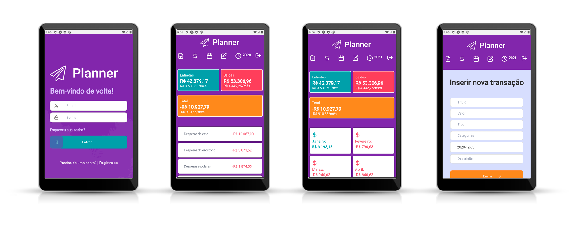

# 🛫 PLANNER-FINANCIAL

# 💻 Planejador financeiro pessoal

  

## 💻 Sobre o Projeto

Pequena aplicação para planejamento e controle financeiro que permite a inserção de transações em categorias. A listagem de dados ocorre por categoria, mês e ano ou ambos. Também é possível duplicar uma transação em até 10 cópias.

A Dashboard principal apresenta a soma das entradas, saídas e o resultado do ano. E ainda apresenta a média mensal de cada uma.

Na Tela de resultado por mês é a apresentado o resultado final na versão responsiva e na versão Desktop são apresentados os valores mensais de entradas, saídas e o resultado do mês.

------

👉 Obervação: Projeto pessoal inicialmente baseado no GoFinance@Rockeseat (www.rocketseat.com.br). 

 ## 💻 Tecnologias do Projeto

- Typescript
- ReactJs 
- Node.js
- Css com Flexbox
- Diversass bibliotecas para react como o React-Datepicker, React-icons, Unform/rockeseat, date-fns, uuid, etc.
- Tecnologias para implementação (docker, postgres, apache)
- Layout da aplicação desenvolvido no Figma

## 💻 Como acessar esse repositório
1. Faça um fork do repositório

2. Instale com yarn ou npm install

3. Configure uma database do postgres no docker

4. Rode o backend com "yarn dev:server" - porta: 3333

5. Rode o frontend com "yarn start" - porta: 3000
6. Ou Faça uma build do frontend  com "yarn build" e rode num servidor web

## :memo: Licença

Esse projeto está sob a licença MIT. Para mais detalhes acesse:  [LICENSE](.github/LICENSE.md).

#  🌍 Outras Telas do projeto

  

# TODO LIST

- Backend: Refatorar para incrementar SOLID
- Frontend: Melhorar código geral
- Frontend: Resolver confirmação para apagar (aparecer somente no item solicitado)
- Frontend: Transformar utilidade para conversão de float em vírgula numa função compartilhada
- Importação e exportação de dados
- Versão de App Mobile